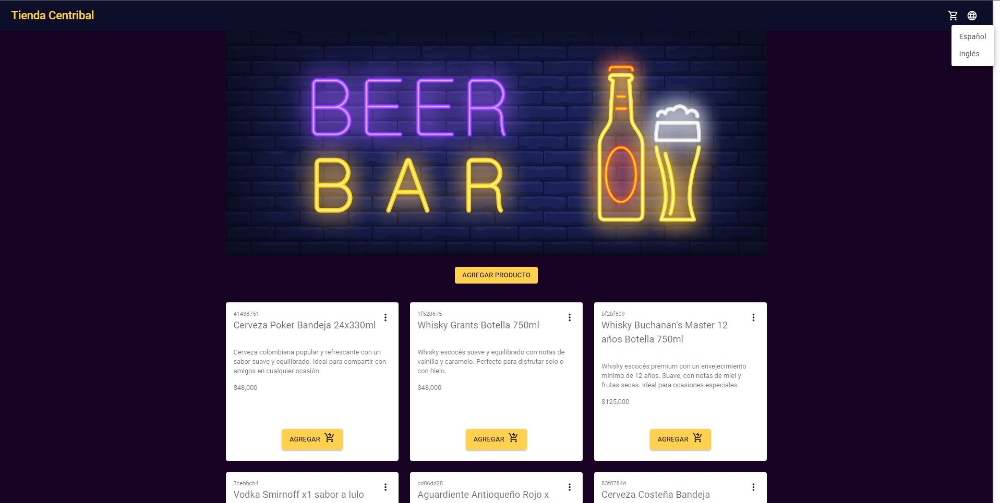
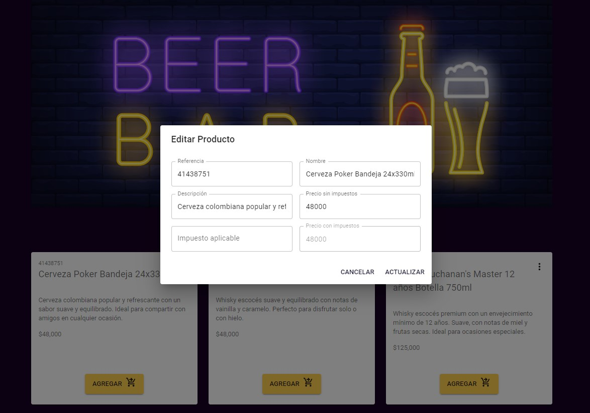
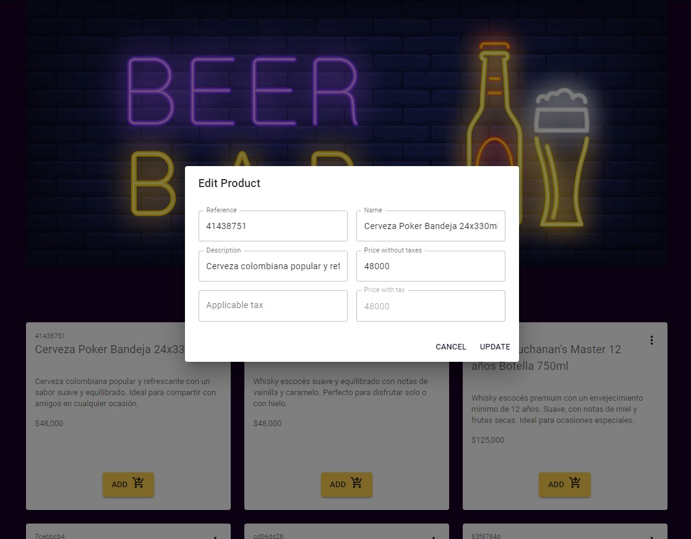
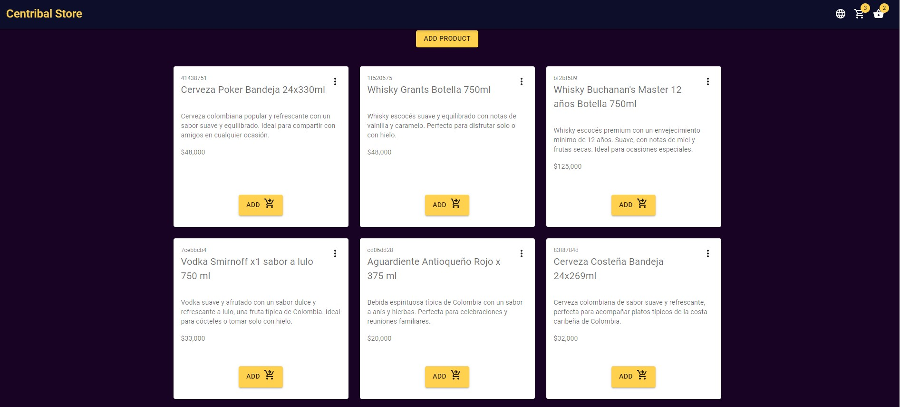
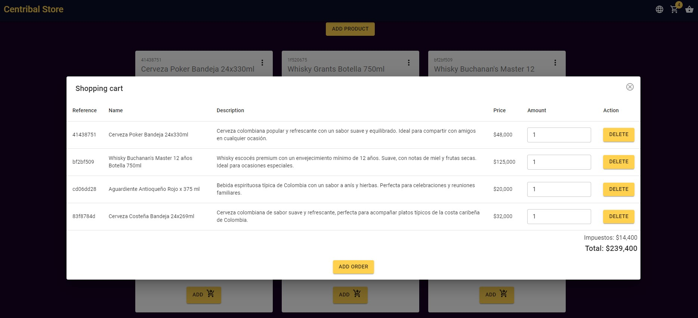
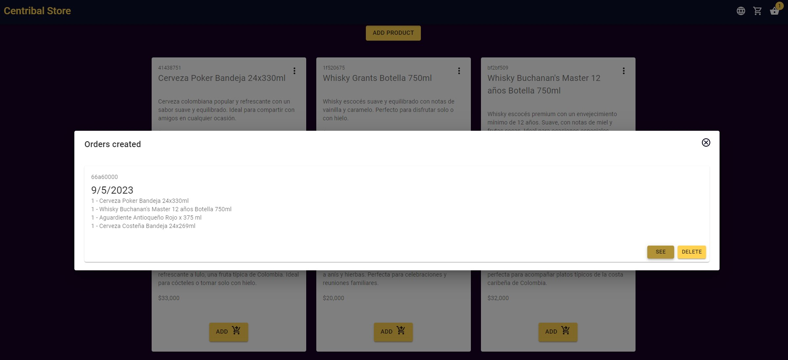
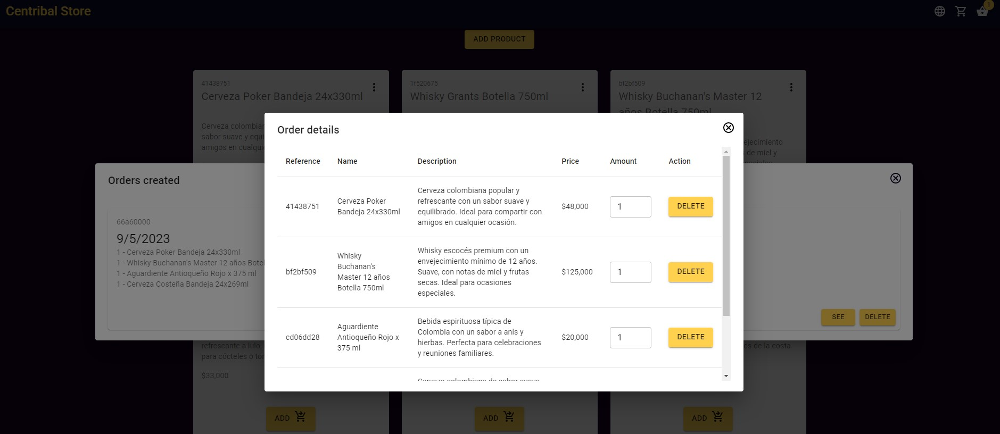

# Getting Started with Vite React

This project is build with React, Vite, Material UI, and TypeScript.

## Demo

## Available Scripts

In the project directory, you can run:

`npm run dev`

Runs the app in the development mode.\
Open [http://localhost:5174](http://localhost:5174) to view it in the browser.

The page performance is very fast, and the page will reload if you make edits.\

## Environment Variables

You can create a `.env` file in the root directory to set environment variables.

`VITE_API_URL = "http://localhost:3200"`

## Run API

The API is build with json-server

`npm run api`

## Run test

The test is build with vitest

`npm test`

## Run docker

For docker, you can run:

`npm run docker:build`

`npm run docker:run`
